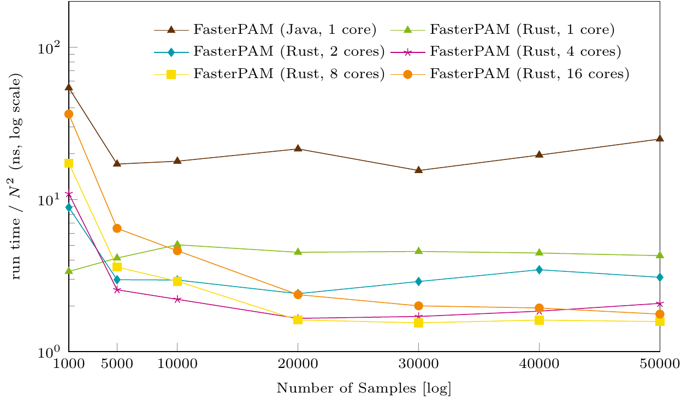

# Summary

A popular technique to cluster non-Euclidean data using arbitrary distance
functions or similarities is k-medoids. The k-medoids problem is NP-hard [@Kariv/Hakimi/79a], hence we need an approximative solution. The best known algorithm for a heuristic
solution with local optimization techniques is Partioning Around Medoids [PAM, @Kaufman/Rousseeuw/87a; -@Kaufman/Rousseeuw/90b], which uses a greedy search, that is significantly faster than an exhaustive search.
FasterPAM [@Schubert/Rousseeuw/2021a] recently introduced a speedup for larger k, by clever caching of partial results. Originally FasterPAM was implemented in Java and published within the open-source library ELKI [@Schubert/Zimek/2019a]. 

We developed the ``rust-kmedoids`` crate (https://github.com/kno10/rust-kmedoids) with implementations of various algorithms of k-medoids clustering, including FasterPAM. It can be used with arbitrary dissimilarites, as it requires a dissimilarity matrix as input. We also provide optional parallelization. The Rust version is then wrapped for use with Python in ``python-kmedoids`` (https://github.com/kno10/python-kmedoids). The core dependency of ``python-kmedoids`` is NumPy [@Harris/2020], and Rayon is required for the optional parallel processing.

# Benchmark

To benchmark the FasterPAM implementation in Rust, we compare the run time of related k-medoids implementations with the Rust implementation. We take the popular MNIST dataset [@Lecun/2010] as input with different number of samples. We evaluate the FasterPAM algorithm in the ELKI open-source toolkit [@Schubert/Zimek/2019a] in Java, k-medoids alternating implementation of ``sklearn_extra.cluster.KMedoids``  (https://github.com/scikit-learn-contrib/scikit-learn-extra) in Python, ``PyClustering`` [@Novikov/2019] in Python and C++, and ``BanditPAM`` [@Tiwari/2020] in Python and C++. We choose a random initialization and precompute a distance matrix with euclidian distance (L2 norm). BanditPAM cannot handle precomputed distance matrices, hence we evaluate BanditPAM separately with including of run time for distance computation.

We run 25~restarts on an AMD EPYC~7302 processor using a single thread, and evaluate the average values. For parallel FasterPAM implementation in Rust we use up to 16 threads on 16 cores and for PyClustering we evaluate only 1 restart due to long run time.

The fastest version without parallel processing is the FasterPAM in Rust with 4.48 ns/$n^2$. The original FasterPAM implementation in ELKI tooks 21.04 ns/$n^2$, 4 times longer. Also sklearn-extra is slower with 13.61 ns/$n^2$, which corresponds to a speedup factor of 3$\times$. With 135257 ns/$n^2$  is PyClustering almost 30000 times slower, so \autoref{fig:example_mnist} shows only sklearn-extra and FasterPAM with its variants. With a parallelization for FasterPAM in Rust with 2 threads, we achieve a 34% faster calculation with 2.95 ns/$n^2$. The more threads are used, the more expensive the constant overhead in the calculation becomes. So there is always a break-even point of number of samples from which a certain number of cores is worth to use.

Since BanditPAM cannot process precomputed distance matrices, here we compare the run time of BanditPAM with that of FasterPAM in Rust including the calculation time for the full distance matrix. BanditPAM for MNIST 5000, 10000, 15000, and 20000 samples is on average 55 times slower than FasterPAM in Rust. Since BanditPAM with almost linear run time scales better than FasterPAM with quadratic run time, a break-even point can be determined with approximately 525.000 samples for MNIST.

| **samples** | **implementation** | **loss ($\varnothing$)** | **run time in s** |
|---------|----------------|---------|----------|---------|----------|
|     5000    |         FasterPAM (Rust) / BanditPAM &nbsp; &nbsp;          |    9365549 / **9361719** &nbsp;     |    **1.48** / 133.19     |
|     10000   |         FasterPAM (Rust) / BanditPAM &nbsp; &nbsp;          |    **18741470** / 18742086 &nbsp;   |    **3.49** / 190.62     |
|     15000   |         FasterPAM (Rust) / BanditPAM &nbsp; &nbsp;          |    28283025 / **28261579** &nbsp;   |    **8.21** / 336.29     |
|     20000   |         FasterPAM (Rust) / BanditPAM &nbsp; &nbsp;          |    37619359 / **37575315** &nbsp;   |    **15.46** / 601.49    |

# Figures

{ width=100% }

# References

